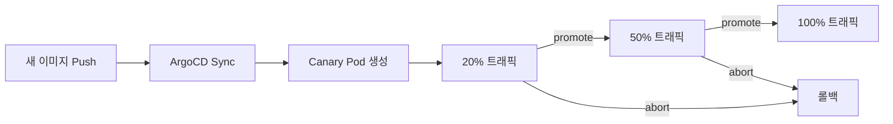

# HoppingMall

구매자와 판매자를 연결하는 온라인 쇼핑몰입니다. 상품 등록부터 주문, 결제, 포인트 적립, 쿠폰, 환불, 배송 추적, 정산까지 커머스 운영에 필요한 전체 흐름을 지원합니다.

[](https://codecov.io/gh/perArdua/hoppingmall)

## 서비스 구조


## 기술 스택

| 분류 | 기술 |
|------|------|
| Language | Kotlin, Java 21 |
| Framework | Spring Boot 3.5, Spring Cloud Gateway |
| DB | MySQL 8.0, H2 (테스트) |
| Messaging | Kafka (EOS, Transactional Outbox) |
| Cache | Redis Cluster (Redisson), Caffeine |
| Communication | gRPC, REST (Resilience4j Circuit Breaker) |
| Auth | JWT (Stateless), Role 기반 (BUYER/SELLER/ADMIN) |
| Infra | Docker Compose, Kind (K8s), Istio, ArgoCD, Argo Rollouts |
| Monitoring | Prometheus, Grafana, Loki, Zipkin |
| CI/CD | GitHub Actions, Canary 배포 (20% → 50% → 100%) |
| Test | JUnit5, Mockito, EmbeddedKafka, Jacoco (80%+) |

## 이벤트 흐름

주문부터 알림까지의 전체 이벤트 흐름입니다.


## 결제 보상 흐름

결제 실패 시 보상 트랜잭션 처리 흐름입니다.


## 도메인

```
user-service        회원, 인증, 멤버십 (등급별 적립률 1~7%)
product-service     상품, 카테고리, 재고, 리뷰, 위시리스트, 통계
order-service       주문, 장바구니, 환불, 배송
payment-service     결제, 포인트, 쿠폰, DLQ
notification-service 알림 (Kafka Consumer)
settlement-service  정산 (판매자 수익 집계)
api-gateway         라우팅, JWT 검증, Rate Limiting
```

## Canary 배포

Argo Rollouts + Istio 기반 Canary 배포를 지원합니다.




## 주요 패턴

- **Transactional Outbox** : 이벤트 발행 보장 (5초 주기 스케줄러)
- **Consumer 멱등성** : eventId 기반 중복 처리 방지 + DataIntegrityViolation catch
- **Saga (2-Phase Step Tracking)** : 분산 트랜잭션 보상 + crash recovery
- **DLQ** : DB 기반 Dead Letter Queue (자동 재시도, 지수 백오프)
- **CQRS** : 상품 도메인 Command/Query 서비스 분리
- **Pessimistic Locking** : 포인트 잔액, 재고 조작 시 비관적 락
- **Circuit Breaker + Retry** : Resilience4j 기반 서비스 간 장애 격리
